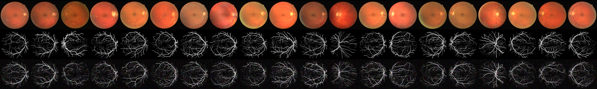

# cGLOW: Conditional Generative Flows  🌟
[](https://pypi.org/project/torch/2.1.2-/)
[](https://pypi.org/project/torchvision/0.16.2-/)
[](https://pypi.org/project/numpy/1.26.4/)
[](https://pypi.org/project/Pillow/10.2.0/)


## Description

The paper "Structured Output Learning with Conditional Generative Flows" by You Lu and Bert Huang. proposes a new approach for structured output learning, called conditional Glow (c-Glow), which is a conditional generative flow model that can directly model the conditional distribution p(y|x) without restrictive assumptions. The authors show that c-Glow can be trained efficiently by exploiting the fact that invertible flows allow exact computation of log-likelihood, and that it can generate structured outputs that are comparable in quality to those produced by state-of-the-art deep structured prediction approaches. The paper evaluates c-Glow on five structured prediction tasks: binary segmentation, multi-class segmentation, color image denoising, depth refinement, and image inpainting. The results demonstrate the effectiveness of c-Glow in handling a variety of structured prediction problems.


## Getting started 🚀

To dive into the transformative world of cGLOW, begin by setting up your environment with these steps. We recommend using a virtual environment for an isolated setup.

1. **Clone the repository**

    ```bash
    git clone https://github.com/Manuelnkegoum-8/cGLOW.git
    cd cGLOW
    ```

2. **Set up a virtual environment** (optional but recommended)

    - For Unix/Linux or MacOS:
        ```bash
        python3 -m venv env
        source env/bin/activate
        ```
    - For Windows:
        ```bash
        python -m venv env
        .\env\Scripts\activate
        ```
3. **Install the requirements**

    ```bash
    pip install -r requirements.txt
    ```

4. **Usage**
    - To train the cGLOW model with default settings:

        ```bash
        ./train.sh
        ```
    - For generating images using a pre-trained model:
        ```bash
        ./inference.sh
        ```

## Results 📊

This code is used for the experiments of binary segmentation on the [Retina Blood Vessel](https://www.kaggle.com/datasets/abdallahwagih/retina-blood-vessel) dataset
### Final segmentation masks


### Evolution of the generated mask


## Acknowledgements 🙏 

- Immense gratitude to the original authors of the Glow model and the vibrant community around generative models, whose work paved the way for advancements like cGLOW.
- Some parts of the code was inspired from [y0ast](https://github.com/y0ast/Glow-PyTorch/)  and [ameroyer](https://github.com/ameroyer/glow_jax)

## Authors 🧑‍💻
- [Manuel NKEGOUM](https://github.com/Manuelnkegoum-8)

## References 📄 
- [Glow: Generative Flow with Invertible 1x1 Convolutions](https://arxiv.org/abs/1807.03039)
- [Structured Output Learning with Conditional Generative Flows](https://arxiv.org/abs/1905.13288)